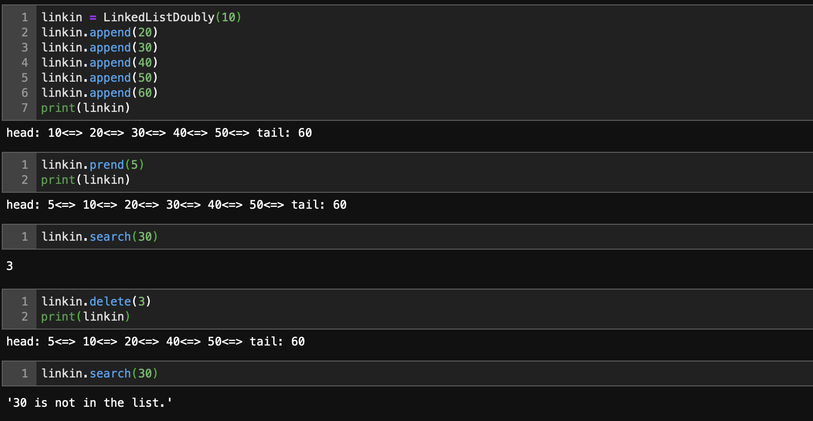
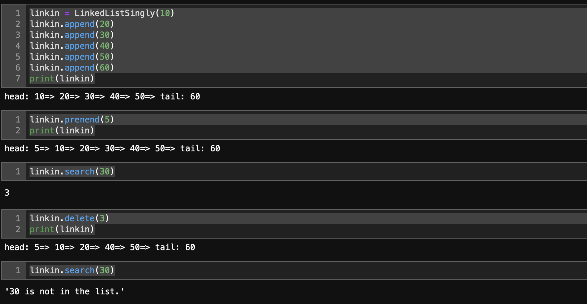

# Linked List Implementation
Linked List Implementation in Python.
Code include both Singly Linked List and Doubly Linked List.
Linked Lists have functions can insert, append, preened, search and delete.
## Singly Linked List

## Doubly Linked List
